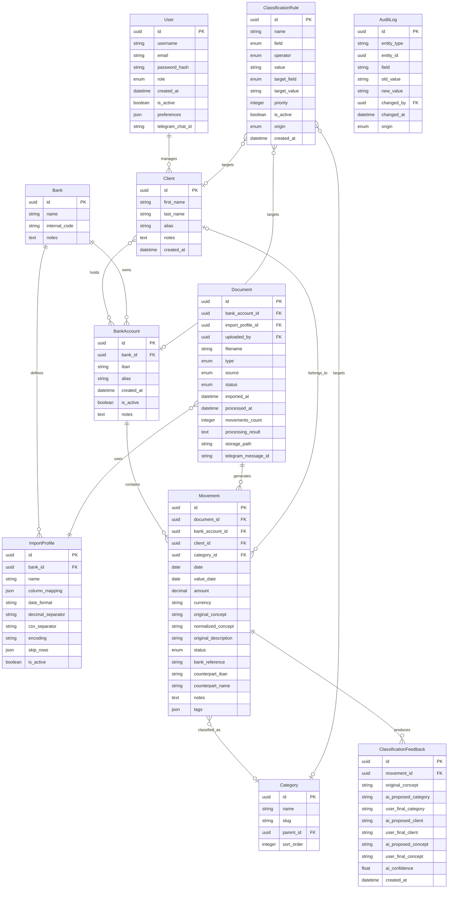

# Modelo de dominio — MVP Gestión de recibos y movimientos bancarios

**Versión:** 0.3
**Fecha:** Agosto 2026

---

## Diagrama de entidades y relaciones



---

## Detalle de entidades

### User

Usuario que opera la aplicación. Gestiona la autenticación, permisos y preferencias. Un usuario puede gestionar varios clientes.

| Campo | Tipo | Descripción |
|---|---|---|
| `id` | uuid (PK) | Identificador único |
| `username` | string | Nombre de usuario |
| `email` | string | Email único |
| `password_hash` | string | Contraseña hasheada |
| `role` | enum | `admin`, `user` |
| `created_at` | datetime | Fecha de alta |
| `is_active` | boolean | Estado activo/inactivo |
| `preferences` | json | Preferencias de la aplicación |
| `telegram_chat_id` | string (nullable, unique) | Chat ID de Telegram para vincular el bot con el usuario |

### Client

Titular o persona relacionada con cuentas bancarias. No es usuario de la aplicación. Representa a quién pertenece una cuenta y sus recibos.

| Campo | Tipo | Descripción |
|---|---|---|
| `id` | uuid (PK) | Identificador único |
| `first_name` | string | Nombre |
| `last_name` | string | Apellidos |
| `alias` | string (nullable) | Alias opcional |
| `notes` | text (nullable) | Notas libres |
| `created_at` | datetime | Fecha de alta |

**Relaciones:** Un cliente puede tener varias cuentas bancarias (many-to-many via tabla pivot `client_bank_account`). Un usuario puede gestionar varios clientes.

### Bank

Entidad financiera.

| Campo | Tipo | Descripción |
|---|---|---|
| `id` | uuid (PK) | Identificador único |
| `name` | string | Nombre del banco |
| `internal_code` | string (nullable) | Código identificador interno |
| `notes` | text (nullable) | Información adicional |

**Relaciones:** Un banco tiene varias cuentas bancarias y varios perfiles de importación.

### BankAccount

Cuenta bancaria. Entidad central que conecta bancos, clientes y movimientos.

| Campo | Tipo | Descripción |
|---|---|---|
| `id` | uuid (PK) | Identificador único |
| `bank_id` | uuid (FK) | Banco al que pertenece |
| `iban` | string | IBAN de la cuenta |
| `alias` | string (nullable) | Nombre o alias |
| `created_at` | datetime | Fecha de alta |
| `is_active` | boolean | Estado activa/inactiva |
| `notes` | text (nullable) | Notas libres |

**Relaciones:** Pertenece a un banco. Tiene varios clientes (many-to-many). Contiene varios movimientos.

### Document

Origen de uno o varios movimientos. Se conserva siempre el fichero original como referencia.

| Campo | Tipo | Descripción |
|---|---|---|
| `id` | uuid (PK) | Identificador único |
| `bank_account_id` | uuid (FK, nullable) | Cuenta de origen si se conoce |
| `import_profile_id` | uuid (FK, nullable) | Perfil de importación utilizado |
| `uploaded_by` | uuid (FK) | Usuario que subió el documento |
| `filename` | string | Nombre del fichero original |
| `type` | enum | `csv`, `pdf`, `image`, `scan`, `other` |
| `source` | enum | `telegram`, `web` — Canal por el que se subió el documento |
| `status` | enum | `pending`, `processing`, `processed`, `needs_review`, `reviewed`, `error` |
| `imported_at` | datetime | Fecha de importación |
| `processed_at` | datetime (nullable) | Fecha de procesamiento |
| `movements_count` | integer | Número de movimientos detectados |
| `processing_result` | text (nullable) | Resultado o errores del procesamiento |
| `storage_path` | string | Ruta de almacenamiento del fichero original |
| `telegram_message_id` | string (nullable) | ID del mensaje de Telegram para referencia |

### Movement

Unidad principal de información. Representa un movimiento bancario o un recibo individual.

| Campo | Tipo | Descripción |
|---|---|---|
| `id` | uuid (PK) | Identificador único |
| `document_id` | uuid (FK) | Documento de origen |
| `bank_account_id` | uuid (FK, nullable) | Cuenta bancaria asociada |
| `client_id` | uuid (FK, nullable) | Cliente asociado |
| `category_id` | uuid (FK, nullable) | Categoría asignada |
| `date` | date | Fecha del movimiento |
| `value_date` | date (nullable) | Fecha de valor |
| `amount` | decimal(12,2) | Importe |
| `currency` | string(3) | Moneda (EUR, USD, etc.) |
| `original_concept` | string | Concepto original tal como aparece en el documento |
| `normalized_concept` | string (nullable) | Concepto normalizado (limpio, legible) |
| `original_description` | text (nullable) | Descripción completa original |
| `status` | enum | `pending`, `auto_classified`, `manually_reviewed`, `discarded`, `duplicate` |
| `bank_reference` | string (nullable) | Identificador del movimiento en el banco |
| `counterpart_iban` | string (nullable) | IBAN de la contrapartida |
| `counterpart_name` | string (nullable) | Nombre de la contrapartida |
| `notes` | text (nullable) | Observaciones del usuario |
| `tags` | json (nullable) | Etiquetas libres |

**Ciclo de vida (State Machine):**

```
pending → auto_classified → manually_reviewed
pending → manually_reviewed
pending → discarded
pending → duplicate
auto_classified → manually_reviewed
auto_classified → discarded
auto_classified → duplicate
```

### Category

Clasificación temática de movimientos. Soporta subcategorías mediante `parent_id`.

| Campo | Tipo | Descripción |
|---|---|---|
| `id` | uuid (PK) | Identificador único |
| `name` | string | Nombre de la categoría |
| `slug` | string | Slug para URLs y código |
| `parent_id` | uuid (FK, nullable) | Categoría padre para subcategorías |
| `sort_order` | integer | Orden de visualización |

**Categorías iniciales:** Alimentación, Electricidad, Agua, Gas, Internet/Telecomunicaciones, Seguros, Impuestos, Transporte, Vivienda, Salud, Ocio, Transferencias, Ingresos, Otros.

### ImportProfile

Define cómo interpretar el formato de un extracto bancario. Asociado a un banco, reutilizable entre importaciones.

| Campo | Tipo | Descripción |
|---|---|---|
| `id` | uuid (PK) | Identificador único |
| `bank_id` | uuid (FK) | Banco asociado |
| `name` | string | Nombre descriptivo del perfil |
| `column_mapping` | json | Mapeo de columnas (`{"fecha": 0, "concepto": 2, "importe": 3}`) |
| `date_format` | string | Formato de fecha (`dd/mm/yyyy`, `yyyy-mm-dd`, etc.) |
| `decimal_separator` | string(1) | Separador decimal (`,` o `.`) |
| `csv_separator` | string(1) | Separador de CSV (`;`, `,`, `\t`) |
| `encoding` | string | Codificación del fichero (`UTF-8`, `ISO-8859-1`, etc.) |
| `skip_rows` | json | Filas a ignorar (`{"header": 1, "footer": 2}`) |
| `is_active` | boolean | Perfil activo/inactivo |

### ClassificationRule

Regla determinista de clasificación. Tiene prioridad sobre la IA cuando la condición se cumple.

| Campo | Tipo | Descripción |
|---|---|---|
| `id` | uuid (PK) | Identificador único |
| `name` | string | Nombre descriptivo |
| `field` | enum | Campo a evaluar: `concept`, `iban`, `counterpart_name`, `amount`, etc. |
| `operator` | enum | Operador: `equals`, `contains`, `starts_with`, `greater_than`, etc. |
| `value` | string | Valor de la condición |
| `target_field` | enum | Campo a asignar: `category`, `client`, `bank_account`, etc. |
| `target_value` | string | Valor a asignar (ID o nombre según el campo) |
| `priority` | integer | Prioridad (menor número = mayor prioridad) |
| `is_active` | boolean | Regla activa/inactiva |
| `origin` | enum | `manual` (creada por el usuario), `auto` (generada desde feedback) |
| `created_at` | datetime | Fecha de creación |

**Ejemplo:** `field=concept`, `operator=contains`, `value=MERCADONA`, `target_field=category`, `target_value=alimentacion`.

### ClassificationFeedback

Registro de correcciones del usuario sobre propuestas de la IA. Alimenta el few-shot prompting contextual.

| Campo | Tipo | Descripción |
|---|---|---|
| `id` | uuid (PK) | Identificador único |
| `movement_id` | uuid (FK) | Movimiento corregido |
| `original_concept` | string | Concepto original del movimiento |
| `ai_proposed_category` | string (nullable) | Categoría que propuso la IA |
| `user_final_category` | string (nullable) | Categoría que eligió el usuario |
| `ai_proposed_client` | string (nullable) | Cliente que propuso la IA |
| `user_final_client` | string (nullable) | Cliente que eligió el usuario |
| `ai_proposed_concept` | string (nullable) | Concepto normalizado propuesto por la IA |
| `user_final_concept` | string (nullable) | Concepto normalizado final |
| `ai_confidence` | float (nullable) | Nivel de confianza de la IA (0.0 a 1.0) |
| `created_at` | datetime | Fecha del feedback |

### AuditLog

Registro de auditoría polimórfico. Captura cualquier cambio en cualquier entidad del sistema.

| Campo | Tipo | Descripción |
|---|---|---|
| `id` | uuid (PK) | Identificador único |
| `entity_type` | string | Tipo de entidad (`movement`, `bank_account`, `client`, etc.) |
| `entity_id` | uuid | ID de la entidad modificada |
| `field` | string | Campo que cambió |
| `old_value` | string (nullable) | Valor anterior |
| `new_value` | string (nullable) | Valor nuevo |
| `changed_by` | uuid (FK) | Usuario que realizó el cambio |
| `changed_at` | datetime | Fecha y hora del cambio |
| `origin` | enum | `manual`, `rule`, `ai` |

---

## Decisiones de diseño

### UUIDs como identificadores

Todas las entidades usan UUID en lugar de autoincrement. Esto facilita la generación de IDs antes de persistir (útil con Symfony Messenger y procesamiento asíncrono) y evita colisiones en imports masivos.

### Movement como entidad central

Todo converge en `Movement`: tiene FK hacia `Document` (de dónde vino), `BankAccount` (a qué cuenta pertenece), `Client` (a quién pertenece) y `Category` (cómo está clasificado). Los campos `client_id` y `category_id` son nullable porque al importar puede que aún no se hayan determinado.

### Client ↔ BankAccount es many-to-many

Se implementa mediante una tabla pivot `client_bank_account`. Esto cubre la cotitularidad donde varias personas comparten una misma cuenta.

### ImportProfile como entidad independiente

No está embebida en `Bank` porque un mismo banco puede tener varios formatos (cuenta corriente vs tarjeta de crédito vs hipoteca). El `column_mapping` es JSON porque la estructura varía entre perfiles.

### ClassificationRule genérica

Los campos `field` + `operator` + `value` definen la condición, y `target_field` + `target_value` definen la acción. El campo `origin` distingue si la regla la creó el usuario manualmente o se generó automáticamente desde el feedback.

### Category con parent_id

Permite subcategorías opcionales (Vivienda → Electricidad, Vivienda → Agua). Si no se usan, `parent_id` queda null. No añade complejidad al MVP pero deja la puerta abierta.

### AuditLog polimórfico

Usa `entity_type` + `entity_id` en lugar de FKs directas. Permite auditar cualquier entidad sin modificar la tabla de auditoría. Se implementa mediante un EventSubscriber de Doctrine (`preUpdate`/`postUpdate`).

### ClassificationFeedback separado del AuditLog

El `AuditLog` registra cualquier cambio para trazabilidad. El `ClassificationFeedback` registra específicamente las correcciones sobre propuestas de la IA, con la estructura necesaria para el few-shot prompting contextual de Ollama.

### Telegram como canal principal de entrada

El bot de Telegram es el medio habitual para subir documentos. La vinculación se hace mediante `telegram_chat_id` en `User` (nullable, unique). `Document` incluye `source` (telegram/web) para saber por dónde entró, y `telegram_message_id` para referenciar el mensaje original. Telegram y la web son dos adaptadores de entrada distintos que comparten los mismos casos de uso del dominio.

### Document.uploaded_by

Todo documento tiene un `uploaded_by` que referencia al `User` que lo subió, tanto si viene de Telegram (se identifica por `chat_id`) como si viene de la web (sesión autenticada).

---

## Tabla pivot

### client_bank_account

| Campo | Tipo | Descripción |
|---|---|---|
| `client_id` | uuid (FK) | Cliente |
| `bank_account_id` | uuid (FK) | Cuenta bancaria |
| `created_at` | datetime | Fecha de asociación |

Clave primaria compuesta: (`client_id`, `bank_account_id`).
